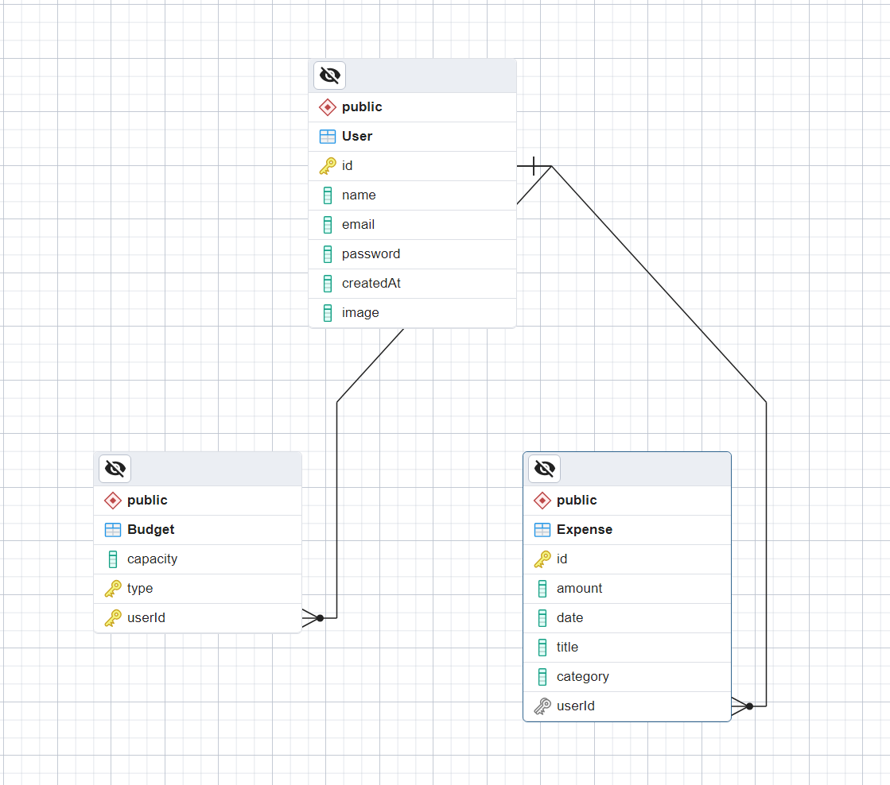

# Expense Tracker

## Table of Contents

1. [Project Overview](#project-overview)
2. [Features](#features)
3. [Tech Stack](#tech-stack)
4. [Database Schema](#database-schema)
5. [API Routes](#api-routes)
6. [Authentication](#authentication)
7. [RESTful Principles](#restful-principles)
8. [Setup and Installation](#setup-and-installation)
9. [Usage](#usage)
10. [Contributing](#contributing)
11. [License](#license)

## Project Overview

The Expense Tracker is a full-stack SaaS web application that allows users to track their expenses, manage budgets, and view their spending habits. Built with a focus on user authentication and secure data management, this application ensures that only authorized users can access their personal financial information. The application features a REST API for handling CRUD operations related to users, expenses, and budgets.

## Features

- User authentication with JWT-based session management.
- CRUD operations for managing expenses and budgets through REST API.
- Categorization of expenses and budgets into predefined categories.
- Responsive UI built using the Radix UI library.
- Data persistence using PostgreSQL and Prisma ORM.
- Protected `/main` route accessible only to logged-in users, enforced by Next Auth middleware.

## Tech Stack

- **Frontend:** React.js (Typescript)
- **Backend:** Next.js (Typescript)
- **Database:** PostgreSQL
- **ORM:** Prisma
- **UI Library:** Radix UI
- **Styling:** Tailwind CSS
- **Authentication:** Next Auth with JWT token-based sessions

## Database Schema

The database consists of three tables: `users`, `expenses`, and `budgets`.



1. **Users Table**

   - `id` (Primary Key)
   - `email` (Unique)
   - `name`
   - `password` (Hashed)
   - `createdAt`
   - `image` (URL to image)

2. **Expenses Table**

   - `id` (Primary Key)
   - `userId` (Foreign Key)
   - `amount`
   - `title`
   - `date`
   - `category` (Predefined categories as ENUM in schema)

3. **Budgets Table**
   - `userId` (Foreign Key)
   - `type` (Predefined categories, part of composite primary key)
   - `capacity`
   - Composite Primary Key: (`userId`, `type`)

The `users` table has a one-to-many relationship with both `expenses` and `budgets` tables, linked through `userId`.

## API Routes

1. **/api/users**

   - **POST:** Create a new user.

2. **/api/expenses**

   - **POST:** Add a new expense.
   - **DELETE:** Delete an expense.

3. **/api/budgets**

   - **POST:** Set a new budget.
   - **PATCH:** Update an existing budget.
   - **DELETE:** Remove a budget.

4. **/api/auth**
   - Next Auth API authentication route.

## Authentication

- The app uses Next Auth for authentication, with sessions managed via JWT tokens.
- The `/main` route, which provides access to the main application dashboard, is protected by Next Auth middleware, ensuring that only logged-in users can access their expense and budget data.

## RESTful Principles

The API follows RESTful principles, using standard HTTP methods (POST, PATCH, DELETE) to perform CRUD operations. Each route is structured to represent a specific resource, and operations are defined clearly to interact with these resources. This approach ensures consistency, scalability, and ease of use for the API.

## Deployment

The application is hosted on Vercel. Continuous Deployment (CD) is configured, meaning any new commits pushed to the main branch on GitHub trigger automatic deployments to the Vercel hosting environment.

## Software Engineering Model

This project follows the Iterative Incremental Development Model, where features are developed one at a time, tested, and integrated incrementally. This approach allows for continuous improvement and adaptation of the application, ensuring stability and functionality with each new feature addition.

## Setup and Installation

1. **Clone the repository:**

   ```bash
   git clone https://github.com/GlowingObsidian/expense-tracker.git
   cd expense-tracker
   ```

2. **Install dependencies:**

   ```bash
   npm install
   ```

3. **Set up environment variables:**
   Create a `.env` file in the root directory with the following variables:

   ```env
   DATABASE_URL_POOLING=your_postgresql_pooling_url
   DATABASE_URL_DIRECT=your_postgresql_direct_url
   NEXTAUTH_SECRET=your_next_auth_secret
   NEXTAUTH_URL=your_next_auth_url
   ```

4. **Run database migrations:**

   ```bash
   npx prisma migrate dev
   ```

5. **Start the development server:**

   ```bash
   npm run dev
   ```

6. **Access the app:**
   Open your browser and navigate to `http://localhost:3000`.

## Usage

- Sign up or log in to access the main dashboard.
- Add, edit, or delete expenses and budgets.
- View your spending and budget status.

## Contributing

Contributions are welcome! Please fork the repository and submit a pull request for any features, bug fixes, or enhancements.

## License

This project is licensed under the MIT License.

---

Feel free to make any further adjustments or let me know if there's more you'd like to include!
